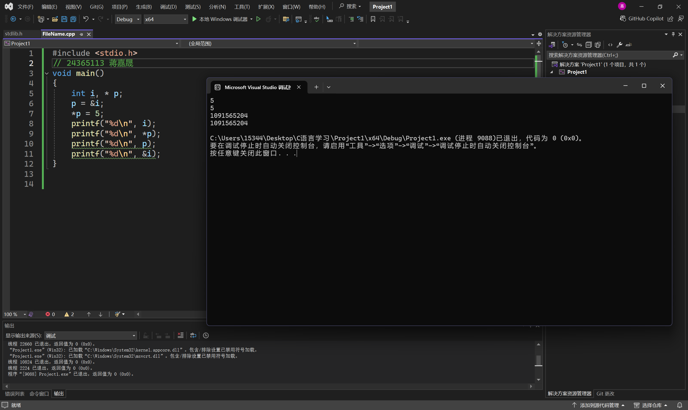
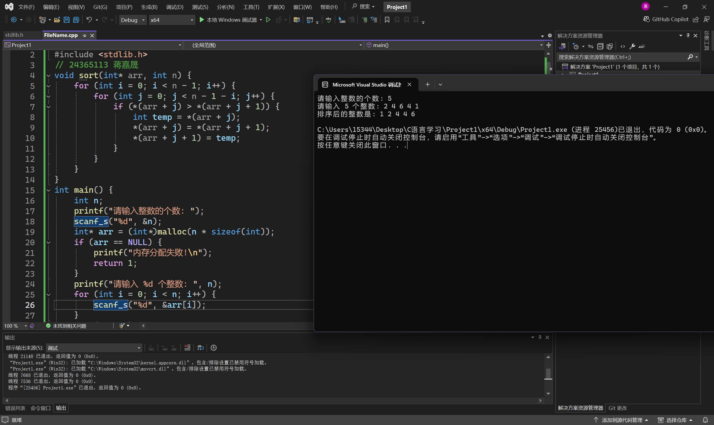
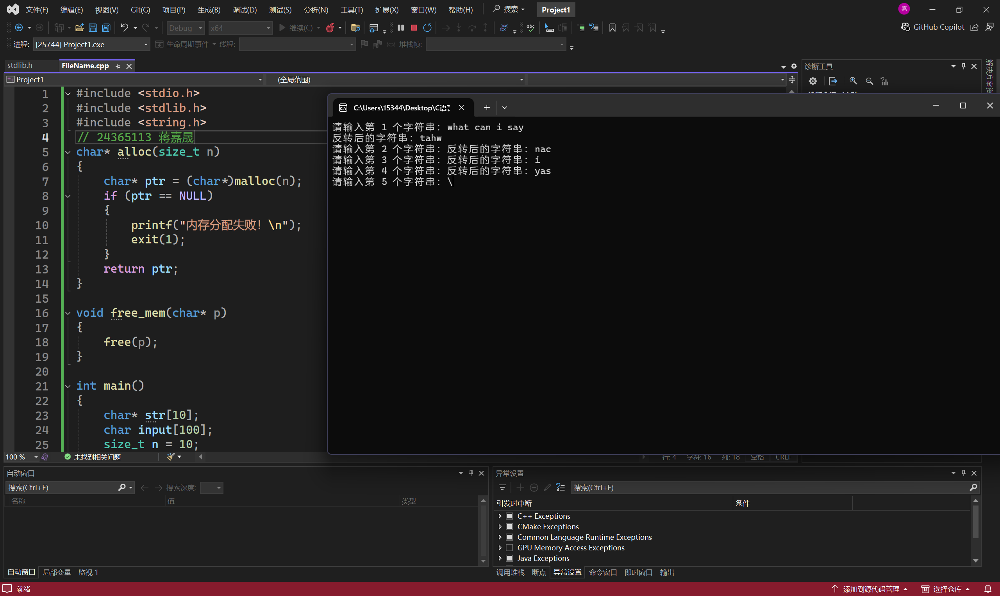

# 实验七 指针

## 一、实验目的
1. 熟练掌握指针、地址、指针类型、void 指针、空指针等概念。
2. 熟练掌握指针变量的定义和初始化、指针的间接访问、指针的加减运算和指针表达式。
3. 会使用数组的指针和指向数组的指针变量。
4. 会使用字符串的指针和指向字符串的指针变量。

## 二、实验准备
1. 复习变量、变量的地址、指针变量的概念并明确区分这三个不同的概念。
2. 复习指针和数组的结合应用。
3. 复习指针的其他理论知识。

## 三、实验内容
三、实验内容
1、阅读程序，分析可能产生的结果，并在机器上运行。

```
#include <stdio.h>
void main()
{
	int i, * p;
	p = &i;
	*p = 5;
	printf("%d\n", i);
	printf("%d\n", *p);
	printf("%d\n", p);
	printf("%d\n", &i);
}
```



回答;可能会出现返回类型不匹配,格式说明符不匹配,指针解引用混淆,变量与地址混淆等问
题

2、用指针对 n 个整数进行排序，并将结果顺序输出。要求排序用一个函数实现，主函数只
输入 n 个整数和输出已排序的 n 个整数。

```
#include <stdio.h>
#include <stdlib.h>
void sort(int* arr, int n) {
    for (int i = 0; i < n - 1; i++) {
        for (int j = 0; j < n - 1 - i; j++) {
            if (*(arr + j) > *(arr + j + 1)) {
                int temp = *(arr + j);
                *(arr + j) = *(arr + j + 1);
                *(arr + j + 1) = temp;
            }
        }
    }
}
int main() {
    int n;
    printf("请输入整数的个数: ");
    scanf_s("%d", &n);
    int* arr = (int*)malloc(n * sizeof(int));
    if (arr == NULL) {
        printf("内存分配失败!\n");
        return 1;
    }
    printf("请输入 %d 个整数: ", n);
    for (int i = 0; i < n; i++) {
        scanf_s("%d", &arr[i]);
    }
    sort(arr, n);
    printf("排序后的整数是: ");
    for (int i = 0; i < n; i++) {
        printf("%d ", arr[i]);
    }
    printf("\n");
    free(arr);
    return 0;
}
```



3、编写一个函数 alloc(n)，用来在内存新开辟一个连续的空间（n 个字节）。再写一个函数
free(p)，将以地址 p 开始的各单元释放。主程序输入 10 个不等长的大写字符串，每输入一
个字符串，应放在新申请的一片连续的空间。该字符串反序输出后，释放它所占用的空间。

```
#include <stdio.h>
#include <stdlib.h>
#include <string.h>

// 函数 alloc：在内存中分配 n 个字节
char* alloc(size_t n) {  // 使用 size_t 类型来匹配 malloc 分配的字节数
    char* ptr = (char*)malloc(n);
    if (ptr == NULL) {
        printf("内存分配失败！\n");
        exit(1);  // 如果内存分配失败，退出程序
    }
    return ptr;
}

// 函数 free：释放 p 指向的内存
void free_mem(char* p) {
    free(p);
}

// 主程序
int main() {
    char *str[10];  // 用于存储指向每个字符串的指针
    char input[100];  // 临时存储输入的字符串
    int n = 10;  // 总共输入 10 个字符串

    // 输入 10 个字符串
    for (int i = 0; i < n; i++) {
        printf("请输入第 %d 个字符串：", i + 1);
        scanf("%99s", input);  // 输入字符串（假设每个字符串不超过 99 个字符）

        // 为该字符串分配内存
        str[i] = alloc(strlen(input) + 1);  // +1 用于存储 '\0' 字符
        strcpy(str[i], input);  // 将输入字符串复制到动态分配的内存

        // 输出反转后的字符串
        int len = strlen(str[i]);
        printf("反转后的字符串：");
        for (int j = len - 1; j >= 0; j--) {
            printf("%c", str[i][j]);
        }
        printf("\n");

        // 释放内存
        free_mem(str[i]);
    }

    return 0;
}

```


